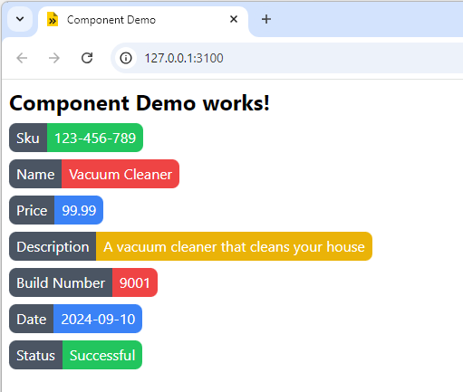
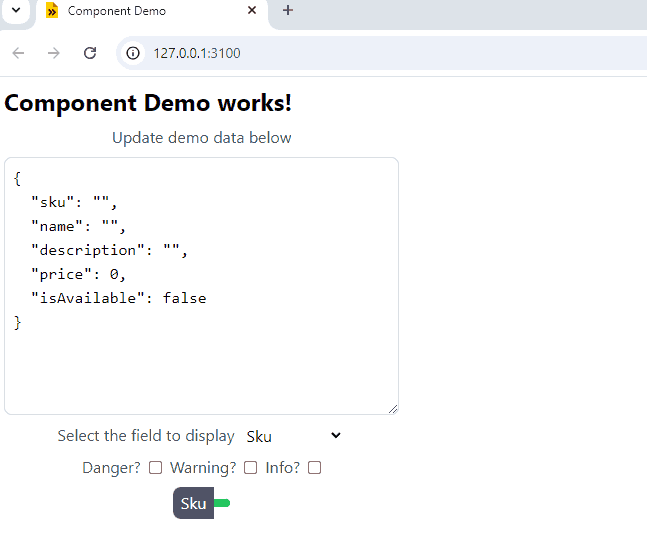
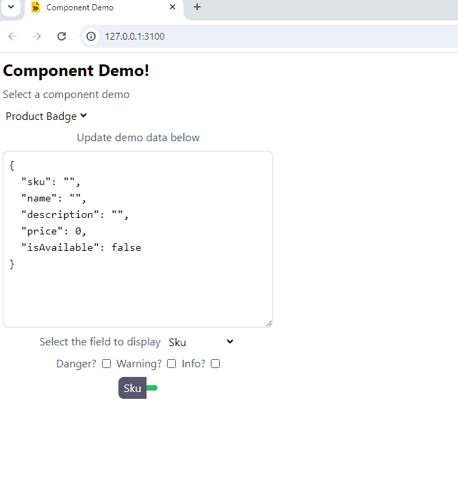
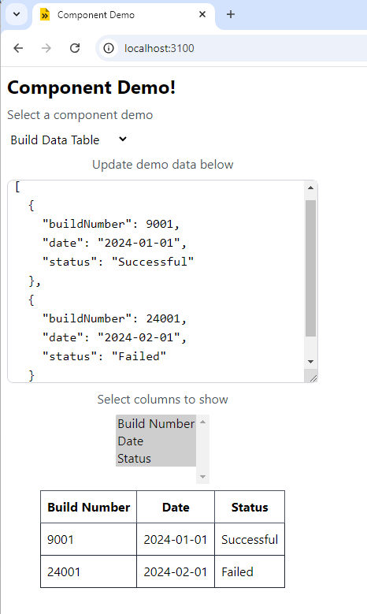

# Typed Component Libraries

_Author_: **Botond János Kovács** (`botond.kovacs@siocode.hu`)

_Date_: **September, 2024**

_This readme contains the full text of the article. The entire source code created in the article is available in this repository as well._

# Disclaimer

This article revolves around _technical concepts_, and the possibility of _boilerplate code generation_. While the article is based around the subject of _frontend generation_, the author is **not a professional designer**. Furthermore, the author of the article is _color-blind_. Please be so kind as to excuse us, if you are not pleased with the _presented visuals_, since making the _best looking thing was **not a scope for this article**_. Thank you!

# Introduction

A _component library_ is a _frontend package_, that contains _reusable components_ we can build _frontend applications with_. There are many examples of component libraries, such as [PrimeReact](https://primereact.org/). If you're opting to use a component library, chances are you are doing so to save time and effort.

In this article I am going to create a _component library from scratch_, that differs from the existing ones in a few ways. The reasons behind the approach introduced in the article include _type-safety_, _reproducibility_, and _further efficiency gains_.

Let's get started!

# What we are building

The following diagram shows the general idea of what we are going to build, with arrows pointing in the _direction of dependencies_.


Explanation:

* The final frontend application under development is the `🚀 Final Frontend App` package.
* We are also building another frontend application demonstrating our palette of components, and their API. This is the `✨ Component Demo / Docs` package.
* Both of these packages depend on the `🔧 Component Library` package, which is an aggregator package for our component sub-packages.
* Our different components live in the `🖌️ Component 1`, `🖌️ Component 2`, etc. packages. Each of these packages exports exactly one component.
* The `📦 Interface 1`, `📦 Interface 2`, etc. packages are not actual packages. These are kind-of "virtual packages", where each interface is a given _data structure_. This will provide the _typed nature_ of what we are building.

There will be multiple dimensions along which we can extend the functionality of our component library, so that we have all the tools necessary to build the final application:

* We can define new _interfaces_, for which components will be created. For example, if we have a _product data table_ component, the _product_ part is the interface.
* We can define new _components archetypes_, which are the "UX building blocks" of our components. For example, if we have a _product data table_ component, the _data table_ part is the archetype.

## Example

The benefits of this approach will become more clear with an example.

One component available in almost all component libraries is the _data table component_. We can put a usual data table component to work with code, that looks something like this:

```tsx
function MyPage() {
    const [data, setData] = useState([
        { id: "1234", name: "Vacuum Cleaner", manufacturer: "ACME Corp." },
        { id: "5678", name: "Washing Machine", manufacturer: "Big Blue Company" },
    ]);

    return <DataTable value={data}
        columns={[
            { field: "id", header: "ID" },
            { field: "name", header: "Name" },
            { field: "manufacturer", header: "Manufacturer" },
        ]}
    />;
}
```

With the _typed components_ approach, the data table components becomes `ProductDataTable`, and the code becomes:

```tsx
function MyPage() {
    const [data, setData] = useState([
        { id: "1234", name: "Vacuum Cleaner", manufacturer: "ACME Corp." },
        { id: "5678", name: "Washing Machine", manufacturer: "Big Blue Company" },
    ]);

    return <ProductDataTable value={data}
        columns={["id", "name", "manufacturer"]}
    />;
}
```

Explanation:

* In case of the imaginary `<DataTable />` component, the `value` property has type `Array<any>`, or `Array<T>` if it is generic. The `<ProductDataTable />` component however has the `value` property with type `Array<Product>`, where `Product` is a _typed interface_.
* The `columns` property of the `<DataTable />` component is an array of objects, where each object has a `field` and a `header` property. The `columns` property of the `<ProductDataTable />` component is an array of strings, where each string is a field name. The accepted field names are part of the _type definition_ of the `Product` interface, meaning that we get a _compile error_ if we were to reference an invalid field name. Furthermore, the `header` property is no longer required, since it can be declared in the component itself, leading to a _cleaner API_. This also helps our IDE in code completion.

Now that we have seen what we are going to build, let's get into the technical details!

# The stack

Allow me to take a moment to explain the _tech stack_ we are going to use to build our component library.

* We will use _React_ as the _frontend library_.
* We will use _TypeScript_ to make our _components type-safe_, and support _IDE integration_.
* We will use _Tailwind CSS V3_ to make it easier to _style our components_.
* We will use the _esbuild_ module bundler to _build the JavaScript bundles_.
* We will use the [ProJor](https://siocode.hu/products/pro-jor) to _generate code_ in the project.

We will create a _mono-repository_ to host all of our packages. This will make it easier to manage the dependencies between the packages.

With these out of the way, let's start building our component library!

# Initial repository setup

Let's start by creating a new directory for our project, and initializing a new git repository in it.

```bash
mkdir typed-component-libraries
cd typed-component-libraries
git init .
```

Let's also add a `.gitignore` file to the repository, to ignore the `node_modules` directory. Create it with the following content:

```
node_modules/
```

To create our mono-repo, we will have to create a `package.json` file in this directory. In this _root `package.json` file_, we are going to include the `workspaces` field, and the _version of all of our dependencies_.

```json
{
    "name": "typed-component-libraries",
    "version": "0.0.1",
    "private": true,
    "workspaces": [
        "packages/*"
    ],
    "dependencies": {
        "react": "18.3.1",
        "react-dom": "18.3.1",
        "classnames": "2.5.1"
    },
    "devDependencies": {
        "@types/react": "18.3.5",
        "@types/react-dom": "18.3.0",
        "tailwindcss": "3.4.10",
        "typescript": "5.5.4",
        "esbuild": "0.23.1",
        "@tailwindcss/typography": "0.5.15",
        "concurrently": "9.0.0"
    }
}
```

Some explanation:

* We are including the `react` and `react-dom` dependencies, since we are using _React_.
* We are also including the `classnames` dependency, which will become handy, because we are using _Tailwind CSS_.
* We are including the `tailwindcss` dependency, which is a _CLI for building Tailwind CSS bundles_.
* We are including the `typescript` dependency.
* We are including the `esbuild` dependency, which is the _module bundler_ we are going to use.
* We are also including the `@tailwindcss/typography` dependency, which is a _plugin for Tailwind CSS_. It is necessary if you want to use the `prose` class in your components.
* We are including the `@types/react` and `@types/react-dom` dependencies, which are the _TypeScript type definitions_ for React and ReactDOM. These are required for the _IDE to function properly_.
* We are using `concurrently`, so that we can run build scripts in parallel.

Let's run `npm install` to install the dependencies of our project. After that, let's create the `packages/` directory, in which all of our packages will live.

## The `app` package

We are first going to focus on the packages living at the end of our dependency chain, namely the `app` and `demo` packages. For starters, let's create the `app` package first.

To do so, we will have to create the `packages/app` directoriy, and create a `package.json` file in it.

_The `package.json` file for the `app` package_

```json
{
    "name": "app",
    "version": "0.0.1",
    "private": true,
    "dependencies": {
        "react": "*",
        "react-dom": "*"
    },
    "devDependencies": {
        "typescript": "*",
        "esbuild": "*",
        "tailwindcss": "*",
        "@types/react": "*",
        "@types/react-dom": "*",
        "@tailwindcss/typography": "*",
        "concurrently": "*"
    }
}
```

There are some other boilerplate files we need to include in the `app` package. Namely, we will need:

* A `tsconfig.json` file, so that the IDE will function properly.
* A `tailwind.config.js` file, which is the configuration file for Tailwind CSS.
* A `tailwind.css` file, which is the _input CSS file_ for Tailwind CSS generation.
* An `index.html` file, which is the first file served by the _web server_ when our _application is opened_ in the browser.

Let's start with the `packages/app/tsconfig.json` file.

```json
{
    "compilerOptions": {
        "target": "ES2015",
        "module": "ES2015",
        "moduleResolution": "Node",
        "allowSyntheticDefaultImports": true,
        "skipLibCheck": true,
        "jsx": "react-native"
    },
    "include": ["src/**/*.ts", "src/**/*.tsx"],
    "exclude": ["node_modules"]
}
```

A note about this `tsconfig.json` file, is that we _must_ set `"jsx": "react-native"` for both `esbuild`, and the IDEs to function properly. The `"moduleResolution": "Node"` line is also critical. We'll use this exact `tsconfig.json` file for all of our packages.

Then, let's create the `packages/app/tailwind.config.js` file.

```javascript
/** @type {import('tailwindcss').Config} */
module.exports = {
    content: [
        "public/**/*.html",
        "src/**/*.{ts,tsx,js,jsx}",
        "../*/src/**/*.{ts,tsx,js,jsx}", // Picks up files from component packages as well
    ],
    theme: {},
    plugins: [
        require("@tailwindcss/typography"),
    ],
};
```

The `tailwind.config.js` file is a _configuration file_ for Tailwind CSS. In this particular case, we are configuring Tailwind to pickup files in directories one level up from the `app` package, and in the `src` directories of the `app` and the component packages. This will be necessary, so that our component sub-packages are also styled with Tailwind CSS. We are also adding the `@tailwindcss/typography` plugin to the configuration.

Let's also create the `tailwind.css` file in `packages/app/src/tailwind.css`, with the following content:

```css
@tailwind base;
@tailwind components;
@tailwind utilities;
```

Lastly, let's create a `public` directory inside `packages/app`, and create the `packages/app/public/index.html` file.

```html
<!DOCTYPE html>
<html lang="en">

<head>
    <meta charset="UTF-8">
    <meta name="viewport" content="width=device-width, initial-scale=1.0">
    <title>My Application</title>
    <link rel="stylesheet" href="/tailwind.css" />
</head>

<body>
    <div id="root"></div>
    <script src="/index.bundle.js"></script>
</body>

</html>
```

With these files out of the way, we can now create a simple test application, to see if we've done everything correctly. Let's create the `packages/app/src/index.tsx` file.

```tsx
import { createRoot } from "react-dom/client";

function App() {
    return <>
        <h1 className="text-2xl font-bold">My Application works!</h1>
    </>
}

const rootEl = document.getElementById("root");
const root = createRoot(rootEl);
root.render(<App />);
```

We are almost ready to test our app, but first we need some slight modifications in the `packages/app/package.json` file. Let's add a few build scripts to it, so we can build and serve our application.

```json
{
    "name": "app",
    "version": "0.0.1",
    "private": true,
    "dependencies": {
        "react": "*",
        "react-dom": "*"
    },
    "devDependencies": {
        "typescript": "*",
        "esbuild": "*",
        "tailwindcss": "*",
        "@types/react": "*",
        "@types/react-dom": "*",
        "@tailwindcss/typography": "*",
        "concurrently": "*"
    },
    "scripts": {
        "build:css": "tailwindcss -i ./src/tailwind.css -o ./public/tailwind.css",
        "build:js": "esbuild ./src/index.tsx --bundle --minify --outfile=./public/index.bundle.js --platform=browser --jsx=automatic",
        "build": "npm run build:css && npm run build:js",
        "serve:css": "tailwindcss -i ./src/tailwind.css -o ./public/tailwind.css --watch",
        "serve:js": "esbuild ./src/index.tsx --bundle --outfile=./public/index.bundle.js --platform=browser --jsx=automatic --servedir=public --serve=0.0.0.0:3000",
        "serve": "concurrently \"npm run serve:css\" \"npm run serve:js\" -n \"CSS,JS\""
    }
}
```

We are defining the following scripts here:

* The `build:js` and `build:css` scripts will take care of building our final application artifacts into the `public` directory.
* The `build` script will run both of the above scripts.
* The `serve:js` and `serve:css` scripts will take care of serving our application, and watching for changes in the `src` directory.
* The `serve` script will run both of the above scripts concurrently.

We are now ready to test the application! Let's open up a terminal, and run `npm run -w app serve`. This will start CSS and JS build processes in parallel, and serve the application on `http://localhost:3000`. You should see the following logs:

```
npm run -w app serve

> app@0.0.1 serve
> concurrently "npm run serve:css" "npm run serve:js" -n "CSS,JS"

[CSS] 
[CSS] > app@0.0.1 serve:css
[CSS] > tailwindcss -i ./src/tailwind.css -o ./public/tailwind.css --watch
[CSS]
[JS]
[JS] > app@0.0.1 serve:js
[JS] > esbuild ./src/index.tsx --bundle --outfile=./public/index.bundle.js --platform=browser --jsx=automatic --servedir=public --serve=0.0.0.0:3000
[JS]
[JS] 
[JS]  > Network: http://192.168.1.10:3000/
[JS]  > Local:   http://127.0.0.1:3000/
[JS]
[CSS] 
[CSS] Rebuilding...
[CSS] 
[CSS] Done in 545ms.
```

Let's open up a browser, and navigate to this URL. If everything went well, you should see the text "My Application works!" on the screen.


## The `demo` package

Now we'll do essentially the same steps we did for the `app` package to create the `demo` package. Let's create the `packages/demo` directory, and create a `package.json` file in it.

```json
{
    "name": "demo",
    "version": "0.0.1",
    "private": true,
    "dependencies": {
        "react": "*",
        "react-dom": "*"
    },
    "devDependencies": {
        "typescript": "*",
        "esbuild": "*",
        "tailwindcss": "*",
        "@types/react": "*",
        "@types/react-dom": "*",
        "@tailwindcss/typography": "*",
        "concurrently": "*"
    },
    "scripts": {
        "build:css": "tailwindcss -i ./src/tailwind.css -o ./public/tailwind.css",
        "build:js": "esbuild ./src/index.tsx --bundle --minify --outfile=./public/index.bundle.js --platform=browser --jsx=automatic",
        "build": "npm run build:css && npm run build:js",
        "serve:css": "tailwindcss -i ./src/tailwind.css -o ./public/tailwind.css --watch",
        "serve:js": "esbuild ./src/index.tsx --bundle --outfile=./public/index.bundle.js --platform=browser --jsx=automatic --servedir=public --serve=0.0.0.0:3100",
        "serve": "concurrently \"npm run serve:css\" \"npm run serve:js\" -n \"CSS,JS\""
    }
}
```

Note, that the only difference between the `app` and `demo` packages is the port number in the `serve:js` script. The `demo` application will be listening on port `3100` instead of `3000`.

We'll also create the `tsconfig.json` file in the `packages/demo` directory:

```json
{
    "compilerOptions": {
        "target": "ES2015",
        "module": "ES2015",
        "moduleResolution": "Node",
        "allowSyntheticDefaultImports": true,
        "skipLibCheck": true,
        "jsx": "react-native"
    },
    "include": ["src/**/*.ts", "src/**/*.tsx"],
    "exclude": ["node_modules"]
}
```

We'll also create the `tailwind.config.js` file in the `packages/demo` directory (just copy-pasted):

```javascript
/** @type {import('tailwindcss').Config} */
module.exports = {
    content: [
        "public/**/*.html",
        "src/**/*.{ts,tsx,js,jsx}",
        "../*/src/**/*.{ts,tsx,js,jsx}", // Picks up files from component packages as well
    ],
    theme: {},
    plugins: [
        require("@tailwindcss/typography"),
    ],
};
```

Let's also create the `public` directory in the `packages/demo` directory, and create the `index.html` file in it:

```html
<!DOCTYPE html>
<html lang="en">

<head>
    <meta charset="UTF-8">
    <meta name="viewport" content="width=device-width, initial-scale=1.0">
    <title>Component Demo</title>
    <link rel="stylesheet" href="/tailwind.css" />
</head>

<body>
    <div id="root"></div>
    <script src="/index.bundle.js"></script>
</body>

</html>
```

Let's also create the `src` directory in the `packages/demo` directory, and create the `tailwind.css` file in it:

```css
@tailwind base;
@tailwind components;
@tailwind utilities;
```

Lastly, let's create the `src/index.tsx` file in the `packages/demo` directory:

```tsx
import { createRoot } from "react-dom/client";

function App() {
    return <>
        <h1 className="text-2xl font-bold">Component Demo works!</h1>
    </>
}

const rootEl = document.getElementById("root");
const root = createRoot(rootEl);
root.render(<App />);
```

We can now test and see if the `demo` app also works. Let's run `npm install`, followed by `npm run -w demo serve`. This will start the CSS and JS build processes in parallel, and serve the application on `http://localhost:3100`. You should see the following logs:

```
npm run -w demo serve

> demo@0.0.1 serve
> concurrently "npm run serve:css" "npm run serve:js" -n "CSS,JS"

[CSS] 
[CSS] > demo@0.0.1 serve:css
[CSS] > tailwindcss -i ./src/tailwind.css -o ./public/tailwind.css --watch
[CSS]
[JS] 
[JS] > demo@0.0.1 serve:js
[JS] > esbuild ./src/index.tsx --bundle --outfile=./public/index.bundle.js --platform=browser --jsx=automatic --servedir=public --serve=0.0.0.0:3100
[JS]
[JS] 
[JS]  > Network: http://192.168.1.10:3100/
[JS]  > Local:   http://127.0.0.1:3100/
[JS]
[CSS] 
[CSS] Rebuilding...
[CSS] 
[CSS] Done in 269ms.
```

Let's open up a browser, and navigate to this URL. If everything went well, you should see the text "Component Demo works!" on the screen.


## The `component-library` package

Now it is finally time to create what we've all gathered here for: our `component-library` package.

First, we must create a new directory in `packages`, called `component-library`. In this directory, let's create a `package.json` file, akin to the one below.

```json
{
    "name": "component-library",
    "version": "0.0.1",
    "private": true,
    "main": "src/index.tsx",
    "dependencies": {
        "react": "*"
    },
    "devDependencies": {
        "typescript": "*"
    }
}
```

Time for some explanation!

* We are defining the `main` field in the `package.json` file, which will point to the entry point of our package. The module bundler in the `app` and `demo` packages will load this file whenever we do `import { Something } from "component-library"`.
* We don't need to go crazy with dependencies, so we're only adding `react` as a dependency, and `typescript` as a dev dependency.
* We don't need build scripts, because we are going to use the `app` and `demo` packages to build and test our components.

Let's also create the `tsconfig.json` file in the `packages/component-library` directory:

```json
{
    "compilerOptions": {
        "target": "ES2015",
        "module": "ES2015",
        "moduleResolution": "Node",
        "allowSyntheticDefaultImports": true,
        "skipLibCheck": true,
        "jsx": "react-native"
    },
    "include": ["src/**/*.ts", "src/**/*.tsx"],
    "exclude": ["node_modules"]
}
```

Lastly, let's create the `src/index.tsx` file in the `packages/component-library` directory:

```tsx
export function TestComponent(
    props: {
        message: string
    }
) {
    return <p>
        Message from TestComponent: {props.message}
    </p>;
}
```

Now we should make some changes to the `app` and `demo` packages, so that they depend on the `component-library` package.

_The modified `packages/app/package.json` file_

```json
{
    "name": "app",
    "version": "0.0.1",
    "private": true,
    "dependencies": {
        "react": "*",
        "react-dom": "*",
        "component-library": "*"
    },
    "devDependencies": {
        "typescript": "*",
        "esbuild": "*",
        "tailwindcss": "*",
        "@types/react": "*",
        "@types/react-dom": "*",
        "@tailwindcss/typography": "*",
        "concurrently": "*"
    },
    "scripts": {
        "build:css": "tailwindcss -i ./src/tailwind.css -o ./public/tailwind.css",
        "build:js": "esbuild ./src/index.tsx --bundle --minify --outfile=./public/index.bundle.js --platform=browser --jsx=automatic",
        "build": "npm run build:css && npm run build:js",
        "serve:css": "tailwindcss -i ./src/tailwind.css -o ./public/tailwind.css --watch",
        "serve:js": "esbuild ./src/index.tsx --bundle --outfile=./public/index.bundle.js --platform=browser --jsx=automatic --servedir=public --serve=0.0.0.0:3000",
        "serve": "concurrently \"npm run serve:css\" \"npm run serve:js\" -n \"CSS,JS\""
    }
}
```

The only thing we're changing here is the inclusion of the `"component-library": "*"` dependency. This will be resolved from the workspace. For brewity, we are not including the changed `demo` package `package.json` file, but the changes are analogous.

Let's try our modifications! Let's modify the `index.tsx` file in the `demo` package, and import our component. Let's give the component a try, and see if it works.

```tsx
import { createRoot } from "react-dom/client";
import { TestComponent } from "component-library";

function App() {
    return <>
        <h1 className="text-2xl font-bold">Component Demo works!</h1>

        <TestComponent message="Message from demo package" />
    </>
}

const rootEl = document.getElementById("root");
const root = createRoot(rootEl);
root.render(<App />);
```

Since we have also modified the `package.json` files, we must run `npm install`. Then, we can run `npm run -w demo serve` to see if our component works. If everything went well, you should see the text "Message from TestComponent: Message from demo package" on the screen.


## Our first component package

For the best structure, we will use _separate packages for each component_. For now, we only have one test component, but let's refactor this into its own separate package, and export it from the `component-library` package. This way we'll have a clear view of what the final package structure will be.

Let's create the `packages/comp-test-component` directory, and a new `package.json` file in it.

```json
{
    "name": "comp-test-component",
    "version": "0.0.1",
    "private": true,
    "main": "src/index.tsx",
    "dependencies": {
        "react": "*"
    },
    "devDependencies": {
        "typescript": "*"
    }
}
```

We also need the exact same `tsconfig.json` file in `packages/comp-test-component` so that IDEs will function correctly.

We'll also move the current `index.tsx` from `packages/component-library/src` to `packages/comp-test-component/src`.

What's left is to:

* Include the `comp-test-component` as a dependency in the `package.json` file of the `component-library` package, and
* Export the `TestComponent` from the `comp-test-component` package in the `component-library` package.

_The modified `packages/component-library/package.json` file_

```json
{
    "name": "component-library",
    "version": "0.0.1",
    "private": true,
    "main": "src/index.tsx",
    "dependencies": {
        "react": "*",
        "comp-test-component": "*"
    },
    "devDependencies": {
        "typescript": "*"
    }
}
```

_The modified `packages/component-library/src/index.tsx` file_

```tsx
export * from "comp-test-component";
```

We are now ready to test our changes. Let's run `npm install`, followed by `npm run -w demo serve`. If everything went well, you should see the text "Message from TestComponent: Message from demo package" on the screen. The difference now, is that the actual component is in a separate package.

## Quick recap

Let's take a moment of break to recap what we've achieved so far:

* We have two React applications, in the `app` and the `demo` packages.
* We have a package called `component-library`, from which we can `import` components.
* We have a package called `comp-test-component`, which exports a `TestComponent`.

Now we are going to do what this article was actually born for, and scale this whole thing up!

In the following steps, we are going to apply a code generator to help us with boilerplate code, and create our actual _typed component library_.

# Scaling up

We are going to use [ProJor](https://siocode.hu/products/pro-jor), the model-based code generator to aid us in generating all the necessary boilerplate code. When working with ProJor, we have two separate tasks:

* Creating a _model_, and
* Creating _templates_ on top of the model.

Let's start with the model!

## Model for typed component libraries

Our typed component library is built on top of a _data structure model_. What this means, is that we will generate a number of different _component archetypes_ for each of the defined data structures. This way, we have everything at hand to create type-safe frontend applications, and our components will also be fully harmonized in design.

The following diagram demonstrates the model we are going to use for the data structures.


* The `BasicType` schema represents _basic types_, such as `string`, `number`, `boolean`, etc.
* The `Field` schema represents _a single field of a data structure_.
* The `Interface` schema represents _a data structure_.

Note, that in ProJor _all objects have an implicit `name` and `description` field_, so we are not explicitly defining these in the model.

If you've never worked with ProJor before, here's a brief introduction:

* All source files for ProJor _must_ reside in the `.projor/` directory in your repository
* Schemas are defined in `.pschema.yaml` files
* Data collections (e.g. instantiated schema object lists) are defined in `.pdata.yaml` files
* Templates are defined in `.ptemplate.mustache` files

With that being said, let's create the `.projor/` directory, and we'll immediately create three additional directories inside: `schema/`, `data/` and `template/`. Inside the `schema/` directory, we'll create the `BasicType.pschema.yaml` file, since this is at the end of the dependency chain. Let's add the following content:

```yaml
id: BasicType
name: Basic Type
description: A basic type, such as int
fields:
  - name: ts
    description: The TypeScript representation of the type
    type: string
  - name: tsDefault
    description: The default value in TypeScript
    type: string
```

In this file, we are describing a schema with the ID `BasicType`, which (apart from the implicit `name` and `description` fields) has a field called `ts` for the TypeScript representation of that type, and a field called `tsDefault` for the default value in TypeScript.

Let's continue by creating the `Field.pschema.yaml` file, with the following content:

```yaml
id: Field
name: Field
description: A field in a data structure
fields:
  - name: type
    description: The basic type of the field
    type: reference
    references: BasicType
```

In this file, we are telling ProJor that each `Field` object has a `type` field, which must reference a `BasicType` object. This will make sense in just a second. But before that, let's create our final schema in the `Interface.pschema.yaml` file:

```yaml
id: Interface
name: Interface
description: A data structure, for which components will be generated
fields:
  - name: fields
    description: The fields of the data structure
    type: attachment
    references: Field
    multiple: true
```

The `Interface` objects will have their implicit `name` and `description` fields, and also an _array of `Field` objects_. Because we are specifying `type: attachment`, the `Field` objects will not live separately from the `Interface` objects, but rather become "embedded" in them.

The next thing we have to do is to define two _ProJor data collections_:

* One for the supported _basic types_ (e.g. `string`, `number`, etc.), and
* One for the _data structures_ we are going to generate component code for

Let's create the `basic.pdata.yaml` file inside the `.projor/data` directory, and add the following content:

```yaml
id: basic
name: Basic Types
description: The basic types supported for data structure fields
schema: BasicType
objects:
  - name: string
    description: A string
    ts: string
    tsDefault: '""'
  - name: number
    description: A number
    ts: number
    tsDefault: "0"
  - name: boolean
    description: A boolean
    ts: boolean
    tsDefault: "false"
```

In this article we are only going to support 3 basic types: `string`, `number`, and `boolean`. We are also defining the TypeScript representation of these types, and their default values. Note, that you could extend this range of basic types to your liking, but you could also support more complex data structures, such as _embedded objects_, _arrays_ or _dictionary types_. For this, you would need schema extension though, and this is out of the scope for this article.

With our basic types set up, let's create the final data collection, `interfaces.pdata.yaml` in `.projor/data`. We will include a single data structure for now, called `Product`:

```yaml
id: interfaces
name: Interfaces
description: The data structures for which component code will be generated
schema: Interface
objects:
  - name: Product
    description: A product that is sold in a webshop
    fields:
      - name: sku
        description: The stock keeping unit
        type: basic#string
      - name: name
        description: The name of the product
        type: basic#string
      - name: description
        description: A description of the product
        type: basic#string
      - name: price
        description: The price of the product
        type: basic#number
      - name: is_available
        description: Whether the product is available
        type: basic#boolean
```

As you can see, we can define arbitrary data structures in this `interfaces.pdata.yaml` now! Please note, that for the `type` field, we are using object references, which are always in `data-collection-id#object-name` format.

Now with our model ready, we can move on to generating _boilerplate code_ using templates!

## The `<XYZBadge />` components

The first _component archetype_ we are going to generate is a simple badge. This badge will take an instance of the corresponding object in its `value` prop, and also the name of a _single field_ in the object to display. It will render a _pill-shaped badge_ with the name and value of the field in it.

To make everything more clear, we will design this component in an _API-first manner_. We want to use this badge in code that looks something like this:

```tsx
function MyPage() {
    const [product, setProduct] = useState({
        sku: "1234",
        name: "Vacuum Cleaner",
        description: "A vacuum cleaner",
        price: 99.99,
        isAvailable: true
    });

    return <>
        <ProductBadge value={product} field="sku" />
        <ProductBadge value={product} field="name" danger />
    </>
}
```

We expect to get badges, that look something like this:


### Generating `comp-xyz-badge` packages

Our first order of business is to set up _templates_ to generate the `packages/comp-xyz-badge` package. In each package directory, we will need a `package.json` file, and a `tsconfig.json` file, so we'll start with these.

Let's create a new file in `.projor/template`, called `badge-component-package-json.ptemplate.mustache`, and add the following content to it:

```
{
    "forEach": "interfaces",
    "filename": "packages/comp-{{kebabCase name}}-badge/package.json",
    "formatUsing": "json"
}
---
{
    "name": "comp-{{kebabCase name}}-badge",
    "description": "Badge component for the {{capitalCase name}} interface",
    "version": "0.0.1",
    "private": true,
    "main": "src/index.tsx",
    "dependencies": {
        "react": "*",
        "classnames": "*"
    }
}
```

Let me explain this file:

* The `.ptemplate.mustache` files are read by ProJor, and they contain two parts:
    * A special _frontmatter section_, describing metadata for the template, and
    * The template content itself, written in _Mustache_ syntax.
* We are using the `forEach` operator, which will result in a _new file for each object in the referenced data collection_ (which is `interfaces`).
* The name of the generated file is templatized as well, and we are also using template placeholders in the template content, so the generated content is populated from the data collection data.

Now, we have to run the `projor generate` command, which will interpolate our templates, and write the result files. If you've done everything correctly, you should get the following output:

```
projor generate

⏳ ProJor running ...
🚀 Generated 1 files
✅ ProJor done
```

You should also see a new directory in `packages/`, called `comp-product-badge`, with a `package.json` file in it. Let's continue by creating the `tsconfig.json` file for this package. Let's create a new file in `.projor/template`, called `badge-component-tsconfig-json.ptemplate.mustache`, and add the following content to it:

```
{
    "forEach": "interfaces",
    "filename": "packages/comp-{{kebabCase name}}-badge/tsconfig.json",
    "formatUsing": "json"
}
---
{
    "compilerOptions": {
        "target": "ES2015",
        "module": "ES2015",
        "moduleResolution": "Node",
        "allowSyntheticDefaultImports": true,
        "skipLibCheck": true,
        "jsx": "react-native"
    },
    "include": ["src/**/*.ts", "src/**/*.tsx"],
    "exclude": ["node_modules"]
}
```

If we run `projor generate` again, we should see in the output, that there are now _2 files being generated_. We should also see a new `tsconfig.json` file in the `comp-product-badge` package directory.

Now, we can create the `index.tsx` file for the badge components. Let's create a new template, called `badge-component-index-tsx.ptemplate.mustache`, and add the following content to it:

```
{
    "forEach": "interfaces",
    "filename": "packages/comp-{{kebabCase name}}-badge/src/index.tsx",
    "formatUsing": "typescript"
}
---
import classNames from "classnames";

/** The field names available to be shown in the badge */
export type {{pascalCase name}}BadgeField = {{#each fields}}"{{camelCase name}}"{{#unless @last}} | {{/unless}}{{/each}};

/** Props for the {{pascalCase name}}Badge component */
export interface I{{pascalCase name}}BadgeProps {
    /** {{{description}}} */
    value: {
        {{#each fields}}
        /** {{{description}}} */
        {{camelCase name}}: {{type.ts}};
        {{/each}}
    };

    /** The field to show in the badge */
    field: {{pascalCase name}}BadgeField;

    /** Whether the badge should be styled as a danger badge (red) */
    danger?: boolean;

    /** Whether the badge should be styled as a warning badge (yellow) */
    warning?: boolean;

    /** Whether the badge should be styled as an info badge (blue) */
    info?: boolean;
}

/** The capitalized names of the fields */
export const {{constantCase name}}_BADGE_FIELD_NAMES = {
    {{#each fields}}
    {{camelCase name}}: "{{capitalCase name}}",
    {{/each}}
};

/** Shows a {{capitalCase name}} badge */
export function {{pascalCase name}}Badge(
    props: I{{pascalCase name}}BadgeProps
) {
    const valueClassname = classNames(
        "text-white px-2 py-1 rounded-r-lg",
        {
            "bg-red-500": props.danger,
            "bg-yellow-500": props.warning,
            "bg-blue-500": props.info,
            "bg-green-500": !props.danger && !props.warning && !props.info
        }
    );
    return (
        <div className="flex flex-row justify-start items-center">
            <div className="bg-gray-600 text-white px-2 py-1 rounded-l-lg">
                { {{constantCase name}}_BADGE_FIELD_NAMES[props.field] }
            </div>
            <div className={valueClassname}>
                {props.value[props.field]}
            </div>
        </div>
    );
}
```

This file may require some additional explanation as well:

* We are using the `forEach` operator again, so we are generating a new file for each object in the `interfaces` data collection.
* We are declaring a _type_ for the field names, that can be used with the badge.
* We are also declaring a _TypeScript interface_ for the badge component props ... 
    * The badge component takes a `value` prop, which is an object with the fields of the data structure.
    * The badge component also takes a `field` prop, which is the field to display in the badge.
    * The badge component can be styled as a danger, warning, or info badge. By default, it is styled as a success badge.
* We are declaring a _constant object_ with the capitalized field names, so we can display them in the badge.
* We are using the `classNames` utility to conditionally style the badge. This is compatible with how Tailwind processes class names in TSX files.
* We are rendering the badge, with the field name on the left, and the field value on the right.

If we run `projor generate` again, we should see in the output, that there are now _3 files being generated_. We should also see a new `index.tsx` file in the `comp-product-badge/src` directory.

### Testing the `<ProductBadge />` component

To test our newly generated component, we still have some homework to do, but this is a one-time chore. We have to:

* Generate the `packages/component-library/package.json` file, so that the `component-library` package depends on the generated component packages, and
* Generate the `packages/component-library/src/index.tsx` file, so that the generated components are exported from the `component-library` package.

Let's create a new template called `component-library-package-json.ptemplate.mustache` in the `.projor/template` directory, and add the following content to it:

```
{
    "map": {
        "interfaces": "interfaces"
    },
    "filename": "packages/component-library/package.json",
    "formatUsing": "json"
}
---
{
    "name": "component-library",
    "version": "0.0.1",
    "private": true,
    "main": "src/index.tsx",
    "dependencies": {
        {{#each interfaces}}
        "comp-{{kebabCase name}}-badge": "*",
        {{/each}}
        "react": "*"
    },
    "devDependencies": {
        "typescript": "*"
    }
}
```

A little explanation for this template:

* Instead of `forEach`, we are using `map`, which will result in a _single file_ being generated. In the `map` operator, we can give a _name_ to the data collections we want to use in the template.
* We are iterating over the `interfaces` data collection, and adding a dependency for each generated component package. We are using the `*` version specifier, and these packages will be resolved from the workspace.
* For convenience, we are adding the `react` dependency _as the last one_, so we don't have to handle the comma at the end of the list.

Now, let's generate the `component-library/src/index.tsx` file. Let's create a new template called `component-library-index-tsx.ptemplate.mustache` in the `.projor/template` directory, and add the following content to it:

```
{
    "map": {
        "interfaces": "interfaces"
    },
    "filename": "packages/component-library/src/index.tsx",
    "formatUsing": "typescript"
}
---
{{#each interfaces}}
export * from "comp-{{kebabCase name}}-badge";
{{/each}}
```

Now let's run `projor generate` again, and after that, we should also execute `npm install`, since out dependency tree has changed.

Now we are ready for testing! Let's modify the `index.tsx` file in the `demo` package, use the following code:

```tsx
import { createRoot } from "react-dom/client";
import { ProductBadge } from "component-library";

function App() {
    const testProduct = {
        sku: "123-456-789",
        name: "Vacuum Cleaner",
        description: "A vacuum cleaner that cleans your house",
        price: 99.99,
        isAvailable: true,
    }

    return <div className="p-2 flex flex-col justify-start items-start gap-2">
        <h1 className="text-2xl font-bold">Component Demo works!</h1>

        <ProductBadge value={testProduct} field="sku" />
        <ProductBadge value={testProduct} field="name" danger />
        <ProductBadge value={testProduct} field="price" info />
        <ProductBadge value={testProduct} field="description" warning />
    </div>
}

const rootEl = document.getElementById("root");
const root = createRoot(rootEl);
root.render(<App />);
```

Now we can run `npm run -w demo serve`, and open the application in the browser. If everything went well, you should see the following:


There are a few benefits to this approach, that I want to highlight as well.

* Code completion works great in IDEs. For example, you get a full list of available `field` values, thanks to the generated code.


* The components are fully typed, and the TypeScript compiler will catch any errors in the component usage. For example, you get an error if you are specifying a wrong value for the `field` prop.


* You will also get a compile error, if you try to plug in an object, whose interface is not compatible with the `Product` interface.


## Adding a new data structure

Now that we have moving parts templatized, we can start exploiting our setup, and write boilerplate really quickly! We can extend the `interfaces.pdata.yaml` file with a new data structure, and have generated:

* The `comp-<new-structure>-badge` package,
* The `component-library/package.json` file, and
* The `component-library/src/index.tsx` file

All with a single command!

I will add a data structure called `Build` to the `interfaces.pdata.yaml` file:

```yaml
  - name: Build
    description: One build of a program
    fields:
      - name: build_number
        description: The build number of the build
        type: basic#number
      - name: date
        description: The date of the build
        type: basic#string
      - name: status
        description: The status of the build
        type: basic#string
```

Now, if we run `projor generate`, we should see that in total _8 files are being generated_. Since we have changed the dependency tree, we also need to run `npm install`.

We can also give the new badge a try in the `demo` package. Let's modify the `index.tsx` file in the `demo` package, and use the following code:

```tsx
<BuildBadge value={testBuild} field="buildNumber" danger />
<BuildBadge value={testBuild} field="date" info />
<BuildBadge value={testBuild} field="status" />
```

If we run `npm run -w demo serve`, we should see the following:



# Improvements

Now, that we have a basic code generator setup going, it is time to do some improvements!

* We will generate a _proper component demo page_, one that allows us to _experiment with the component props_.
* We will also extend our range of _component archetypes_ with a new item: a _data table_. This will be a component that takes an array of objects, and displays them in a table.

## The proper demo page

To make our component library a proper one, we need a page where the components, and their properties are showcased. Furthermore, we will create a "playground" to preview the different settings of the components.

For this, we will have to create templates for the `demo` package. We will outsource the different component demo pages to their respective `.tsx` file, and `import` these from the `index.tsx` file. Let's create a new template, called `badge-component-demo-page-tsx.ptemplate.mustache`, and add the following content to it:

```
{
    "forEach": "interfaces",
    "filename": "packages/demo/src/{{kebabCase name}}-badge-demo.tsx",
    "formatUsing": "typescript"
}
---
import {
    useState,
    useEffect
} from "react";
import {
    I{{pascalCase name}}BadgeProps,
    {{pascalCase name}}BadgeField,
    {{constantCase name}}_BADGE_FIELD_NAMES,
    {{pascalCase name}}Badge,
} from "component-library";

const {{constantCase name}}_BADGE_FIELD_NAMES_LIST = Object.keys({{constantCase name}}_BADGE_FIELD_NAMES) as Array<{{pascalCase name}}BadgeField>;

const {{constantCase name}}_DEFAULT_DATA = {
    {{#each fields}}
    {{camelCase name}}: {{{type.tsDefault}}},
    {{/each}}
};

export function {{pascalCase name}}BadgeDemo() {
    const [demoField, setDemoField] = useState<{{pascalCase name}}BadgeField>(
        {{constantCase name}}_BADGE_FIELD_NAMES_LIST[0]
    );
    const [demoDanger, setDemoDanger] = useState<boolean>(false);
    const [demoWarning, setDemoWarning] = useState<boolean>(false);
    const [demoInfo, setDemoInfo] = useState<boolean>(false);
    const [demoDataJson, setDemoDataJson] = useState<string>(
        JSON.stringify({{constantCase name}}_DEFAULT_DATA, null, 2)
    );
    const [demoDataObject, setDemoDataObject] = useState<any>(
        {{constantCase name}}_DEFAULT_DATA
    );
    const [demoDataParseError, setDemoDataParseError] = useState<string | null>(
        null
    );

    // Try to update the demo data object when the JSON changes
    useEffect(
        () => {
            try {
                setDemoDataObject(JSON.parse(demoDataJson));
                setDemoDataParseError(null);
            } catch (error) {
                setDemoDataParseError(error.message);
            }
        },
        [demoDataJson]
    );
    
    return <div className="flex flex-col justify-start items-center gap-2">

        <p className="text-gray-600">Update demo data below</p>
        <textarea rows={10} cols={40} value={demoDataJson} onChange={(e) => setDemoDataJson(e.target.value)}
            className="border border-gray-300 rounded-lg p-2 font-mono"
        />

        <div className="flex flex-row justify-start items-center gap-2">
            <label className="text-gray-600">Select the field to display</label>
            <select value={demoField} 
                onChange={(e) => setDemoField(e.target.value as {{pascalCase name}}BadgeField)}>
                { 
                    {{constantCase name}}_BADGE_FIELD_NAMES_LIST.map(
                        (field) => (
                            <option key={field} value={field}>{ {{constantCase name}}_BADGE_FIELD_NAMES[field] }</option>
                        )
                    ) 
                }
            </select>
        </div>

        <div className="flex flex-row justify-center items-center gap-2">
            <div className="flex flex-row justify-start items-center gap-2">
                <label className="text-gray-600">Danger?</label>
                <input type="checkbox" checked={demoDanger} onChange={(e) => setDemoDanger(e.target.checked)} />
            </div>

            <div className="flex flex-row justify-start items-center gap-2">
                <label className="text-gray-600">Warning?</label>
                <input type="checkbox" checked={demoWarning} onChange={(e) => setDemoWarning(e.target.checked)} />
            </div>

            <div className="flex flex-row justify-start items-center gap-2">
                <label className="text-gray-600">Info?</label>
                <input type="checkbox" checked={demoInfo} onChange={(e) => setDemoInfo(e.target.checked)} />
            </div>
        </div>

        <{{pascalCase name}}Badge 
            value={demoDataObject}
            field={demoField}
            danger={demoDanger}
            warning={demoWarning}
            info={demoInfo} />
    </div>;

}
```

Time for some explanation!

* We are using `forEach`, so a separate demo page is generated for each badge component.
* At the beginning of the file, we are `import`ing the necessary types and the badge component itself.
* We are defining a list of field names, and the default data object.
* We are defining the `{{pascalCase name}}BadgeDemo` component, which will be rendered in the demo page. In this component we have state variables for the _field_, and other _props_ of the component.
* We also have a JSON text field, so that we can experiment with different data objects.

Now let's do a quick test, and modify the `index.tsx` in the `demo` package to show the `ProductBadgeDemo` component:

```tsx
import { createRoot } from "react-dom/client";
import { ProductBadgeDemo } from "./product-badge-demo";

function App() {
    return <div className="p-2 flex flex-col justify-start items-start gap-2">
        <h1 className="text-2xl font-bold">Component Demo works!</h1>

        <ProductBadgeDemo />
    </div>
}

const rootEl = document.getElementById("root");
const root = createRoot(rootEl);
root.render(<App />);
```

Now we can run `npm run -w demo serve`, and open the application in the browser. If everything went well, you should see the following:



Alright! It is time to make some "proper" navigation for the demo page! Let's create a new template, called `demo-index-tsx.ptemplate.mustache`, and add the following content to it:

```
{
    "map": {
        "interfaces": "interfaces"
    },
    "filename": "packages/demo/src/index.tsx",
    "formatUsing": "typescript"
}
---
import { createRoot } from "react-dom/client";
import {
    useState,
    useEffect,
    useRef
} from "react";
{{#each interfaces}}
import { {{pascalCase name}}BadgeDemo } from "./{{kebabCase name}}-badge-demo";
{{/each}}

const DEMOS = {
    {{#each interfaces}}
    {{pascalCase name}}BadgeDemo,
    {{/each}}
};

const DEMO_NAMES = {
    {{#each interfaces}}
    {{pascalCase name}}BadgeDemo: "{{capitalCase name}} Badge",
    {{/each}}
};

const DEMO_NAMES_LIST = Object.keys(DEMO_NAMES);

function App() {
    const currentDemoComponentRef = useRef(
        DEMOS[DEMO_NAMES_LIST[0]]
    )
    const [currentDemoKey, setCurrentDemoKey] = useState<string>(DEMO_NAMES_LIST[0]);
    const [demoUpdateKey, setDemoUpdateKey] = useState<number>(0);

    // Update the current demo component when the key changes
    useEffect(
        () => {
            currentDemoComponentRef.current = DEMOS[currentDemoKey];
            setDemoUpdateKey(demoUpdateKey + 1);
        },
        [currentDemoKey]
    );

    return <div className="p-2 flex flex-col justify-start items-start gap-2">
        <h1 className="text-2xl font-bold">Component Demo!</h1>

        <p className="text-gray-600">Select a component demo</p>

        <select value={currentDemoKey} onChange={(e) => setCurrentDemoKey(e.target.value)}>
            {
                DEMO_NAMES_LIST.map(
                    (demoKey) => (
                        <option key={demoKey} value={demoKey}>{DEMO_NAMES[demoKey]}</option>
                    )
                )
            }
        </select>

        <currentDemoComponentRef.current key={demoUpdateKey} />
    </div>
}

const rootEl = document.getElementById("root");
const root = createRoot(rootEl);
root.render(<App />);
```

Now we can run `projor generate`, and after that, observe the changes in the browser. If all went well, you should see the following:



## The `<XYZTable />` component

Now, we'll extend the range of available _component archetypes_: we are going to create a _data table component_ for each of the defined interfaces.

Let's first gather the points where we'll have to make changes:

* We will need the `comp-xyz-table` packages, so we have to generate the `package.json`, `tsconfig.json` and `index.tsx` files for these.
* We will also need to modify the template responsible for generating the `component-library/package.json` file, and the `component-library/src/index.tsx` file.
* We will need to generate a _demo page_ for the data tables as well, and modify the `index.tsx` file in the `demo` package to show the `ProductTableDemo` component.

Let's start with the `comp-xyz-table` package. We'll create a new template, called `table-component-package-json.ptemplate.mustache`, and add the following content to it:

```
{
    "forEach": "interfaces",
    "filename": "packages/comp-{{kebabCase name}}-table/package.json",
    "formatUsing": "json"
}
---
{
    "name": "comp-{{kebabCase name}}-table",
    "description": "Data table component for the {{capitalCase name}} interface",
    "version": "0.0.1",
    "private": true,
    "main": "src/index.tsx",
    "dependencies": {
        "react": "*",
        "classnames": "*"
    }
}
```

Let's also create the `table-component-tsconfig-json.ptemplate.mustache` file (almost exactly the same, as in the case of the badge component):

```
{
    "forEach": "interfaces",
    "filename": "packages/comp-{{kebabCase name}}-table/tsconfig.json",
    "formatUsing": "json"
}
---
{
    "compilerOptions": {
        "target": "ES2015",
        "module": "ES2015",
        "moduleResolution": "Node",
        "allowSyntheticDefaultImports": true,
        "skipLibCheck": true,
        "jsx": "react-native"
    },
    "include": ["src/**/*.ts", "src/**/*.tsx"],
    "exclude": ["node_modules"]
}
```

Finally, we will create the `table-component-index-tsx.ptemplate.mustache` file:

```
{
    "forEach": "interfaces",
    "filename": "packages/comp-{{kebabCase name}}-table/src/index.tsx",
    "formatUsing": "typescript"
}
---
import classNames from "classnames";

/** The columns available to be shown in the data table */
export type {{pascalCase name}}DataTableColumn = {{#each fields}}"{{camelCase name}}"{{#unless @last}} | {{/unless}}{{/each}};

/** Props for the {{pascalCase name}}DataTable component */
export interface I{{pascalCase name}}DataTableProps {
    /** {{{description}}} */
    value: Array<{
        {{#each fields}}
        /** {{{description}}} */
        {{camelCase name}}: {{type.ts}};
        {{/each}}
    }>;

    /** The columns to show in the data table */
    columns: Array<{{pascalCase name}}DataTableColumn>;
}

/** The capitalized names of the columns */
export const {{constantCase name}}_DATA_TABLE_COLUMN_NAMES = {
    {{#each fields}}
    {{camelCase name}}: "{{capitalCase name}}",
    {{/each}}
};

/** Shows a {{capitalCase name}} data table */
export function {{pascalCase name}}DataTable(
    props: I{{pascalCase name}}DataTableProps
) {
    const columnHeaderCells = props.columns.map(
        (column, index) => (
            <th key={index} className="p-2 border border-gray-600">
                { {{constantCase name}}_DATA_TABLE_COLUMN_NAMES[column] }
            </th>
        )
    );
    const dataRows = props.value.map(
        (row, rowIndex) => (
            <tr key={rowIndex}>
                {
                    props.columns.map(
                        (column, columnIndex) => (
                            <td key={columnIndex} className="p-2 border border-gray-800">
                                {row[column]}
                            </td>
                        )
                    )
                }
            </tr>
        )
    );
    return (
        <table className="table-auto">
            <thead>
                <tr>
                    {columnHeaderCells}
                </tr>
            </thead>
            <tbody>
                {dataRows}
            </tbody>
        </table>
    );
}
```

Now the table component is ready. The next step is to make the `component-library` package depend on our table components, and have it export these new components as well.

Let's make a few modifications to the `component-library-package-json.ptemplate.mustache` file:

```
{
    "map": {
        "interfaces": "interfaces"
    },
    "filename": "packages/component-library/package.json",
    "formatUsing": "json"
}
---
{
    "name": "component-library",
    "version": "0.0.1",
    "private": true,
    "main": "src/index.tsx",
    "dependencies": {
        {{#each interfaces}}
        "comp-{{kebabCase name}}-badge": "*",
        "comp-{{kebabCase name}}-table": "*",
        {{/each}}
        "react": "*"
    },
    "devDependencies": {
        "typescript": "*"
    }
}
```

Then, we'll also modify the `component-library-index-tsx.ptemplate.mustache` file:

```
{
    "map": {
        "interfaces": "interfaces"
    },
    "filename": "packages/component-library/src/index.tsx",
    "formatUsing": "typescript"
}
---
{{#each interfaces}}
export * from "comp-{{kebabCase name}}-badge";
export * from "comp-{{kebabCase name}}-table";
{{/each}}
```

What's left is to create a _demo page_ for the data tables, and modify the `index.tsx` file in the `demo` package to include the `ProductTableDemo` component in the navigation. Let's create a new template, called `table-component-demo-page-tsx.ptemplate.mustache`, and add the following content to it:

```
{
    "forEach": "interfaces",
    "filename": "packages/demo/src/{{kebabCase name}}-table-demo.tsx",
    "formatUsing": "typescript"
}
---
import {
    useState,
    useEffect
} from "react";
import {
    I{{pascalCase name}}DataTableProps,
    {{pascalCase name}}DataTableColumn,
    {{constantCase name}}_DATA_TABLE_COLUMN_NAMES,
    {{pascalCase name}}DataTable,
} from "component-library";

const {{constantCase name}}_DATA_TABLE_COLUMNS_LIST = Object.keys({{constantCase name}}_DATA_TABLE_COLUMN_NAMES) as Array<{{pascalCase name}}DataTableColumn>;

const {{constantCase name}}_DEFAULT_ARRAY = [
    {
    {{#each fields}}
        {{camelCase name}}: {{{type.tsDefault}}},
    {{/each}}
    }
];

export function {{pascalCase name}}DataTableDemo() {
    const [demoColumns, setDemoColumns] = useState<Array<{{pascalCase name}}DataTableColumn>>(
        {{constantCase name}}_DATA_TABLE_COLUMNS_LIST
    );
    const [demoDataJson, setDemoDataJson] = useState<string>(
        JSON.stringify({{constantCase name}}_DEFAULT_ARRAY, null, 2)
    );
    const [demoDataArray, setDemoDataArray] = useState<Array<any>>(
        {{constantCase name}}_DEFAULT_ARRAY
    );

    // Try to update the demo data array when the JSON changes
    useEffect(
        () => {
            try {
                setDemoDataArray(JSON.parse(demoDataJson));
            } catch (error) {
                console.error(error);
            }
        },
        [demoDataJson]
    );

    return <div className="flex flex-col justify-start items-center gap-2">

        <p className="text-gray-600">Update demo data below</p>
        <textarea rows={10} cols={40} value={demoDataJson} onChange={(e) => setDemoDataJson(e.target.value)}
            className="border border-gray-300 rounded-lg p-2 font-mono"
            placeholder="Enter an array of objects here"
        />

        <p className="text-gray-600">Select columns to show</p>
        <select multiple={true} value={demoColumns} onChange={(e) => setDemoColumns(Array.from(e.target.selectedOptions, (option) => option.value as {{pascalCase name}}DataTableColumn))}>
            {{#each fields}}
            <option value="{{camelCase name}}">{{capitalCase name}}</option>
            {{/each}}
        </select>

        <{{pascalCase name}}DataTable
            value={demoDataArray}
            columns={demoColumns}
        />

    </div>;
}
```

Now we can modify the `index.tsx` file in the `demo` package to show the `ProductTableDemo` component in the list of selectable demos:

* First, we have to include the correct `import` at the beginning of the file:

```
{{#each interfaces}}
import { {{pascalCase name}}BadgeDemo } from "./{{kebabCase name}}-badge-demo";
import { {{pascalCase name}}DataTableDemo } from "./{{kebabCase name}}-table-demo";
{{/each}}
```

* We also have to extend the `DEMOS` and `DEMO_NAMES` variables:

```
const DEMOS = {
    {{#each interfaces}}
    {{pascalCase name}}BadgeDemo,
    {{pascalCase name}}DataTableDemo,
    {{/each}}
};

const DEMO_NAMES = {
    {{#each interfaces}}
    {{pascalCase name}}BadgeDemo: "{{capitalCase name}} Badge",
    {{pascalCase name}}DataTableDemo: "{{capitalCase name}} Data Table",
    {{/each}}
};
```

Now we are ready for testing! Let's run `projor generate` to generate the code, followed by `npm install` due to the changed dependency tree. After that, we should run `npm run -w demo serve`, and open the application in the browser. If everything went well, you should be able to select the `Product Data Table` and `Build Data Table` demos, try them out. It should look like this (after some fiddling around on the UI):



# Conclusion

In this article, we have set up a _monorepo_ for a _typed component library_. Using a code generator, we were able to deal with all boilerplate code associated with the large number of packages, and type definitions. Our setup resulted in a _type-safe_, and _IDE-friendly_ component library.

Happy frontend development! 🚀
